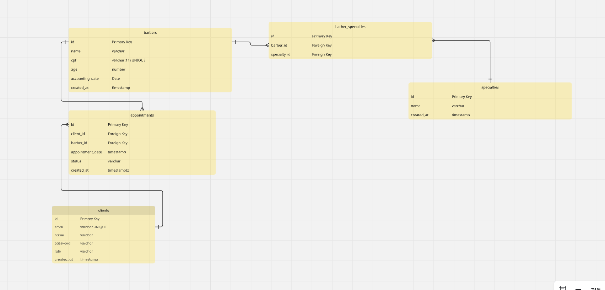

Como Configurar o Projeto
1️⃣ Instale as dependências
```bash
npm install
```
2️⃣ Configure as variáveis de ambiente

Crie um arquivo .env na raiz do projeto e adicione as seguintes variáveis:

# Configuração do banco de dados

```bash
DB_HOST=localhost
DB_PORT=5432
DB_USER=postgres
DB_PASSWORD=root
DB_NAME=barber_db
```

# Configurações de autenticação

```bash
SECRET_KEY=MINHA_SENHA_SECRETA
DEFAULT_PASSWORD_ADMIN=123
```

Observação: Como este é um aplicativo de teste/fictício, estas informações estão sendo fornecidas publicamente. Em um ambiente real, não compartilhe senhas ou chaves secretas.

4️⃣ Execute as migrações SQL diretamente no container Docker

```bash
Get-Content migrations/001_create_clients_table.sql | docker exec -i container_barber_db psql -U postgres -d barber_db
Get-Content migrations/002_create_barbers_table.sql | docker exec -i container_barber_db psql -U postgres -d barber_db
Get-Content migrations/003_create_specialties_table.sql | docker exec -i container_barber_db psql -U postgres -d barber_db
Get-Content migrations/004_create_barber_specialties_table.sql | docker exec -i container_barber_db psql -U postgres -d barber_db
Get-Content migrations/005_create_appointments_table.sql | docker exec -i container_barber_db psql -U postgres -d barber_db
```

Caso esteja utilizando Linux, o processo pode ser diferente ⚠️

Rode o seed para criar o user admin

```bash
npm run seed:admin
```

5️⃣ Documentação das Rotas
Para ver o mapeamento das rotas, acesse:

```bash
http://localhost:3001/api
```

```bash
npm run seed:admin
```

5️⃣ Observações finais

Certifique-se de que o PostgreSQL está rodando no host definido no .env.

A porta padrão do backend do projeto é 3001.

Depois de configurar e aplicar as migrações, você já pode iniciar o projeto com:

```bash
npm run start:dev
```

Diagrama Entidade-Relacionamento (ERD)

